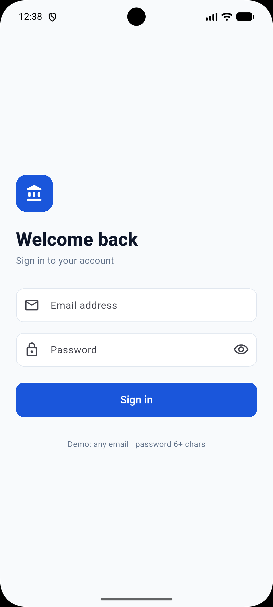
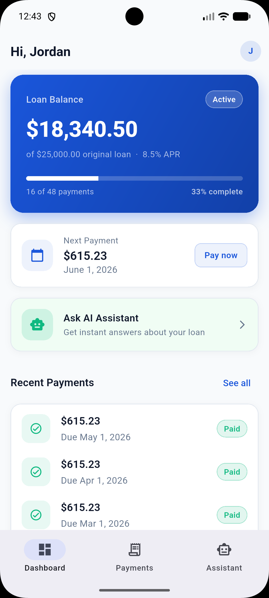
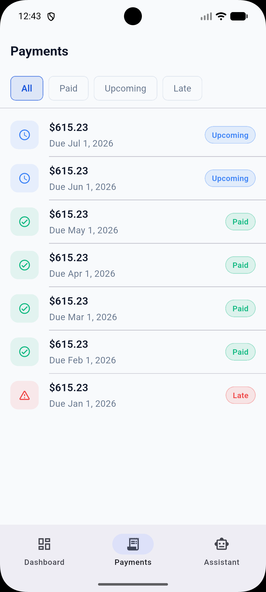
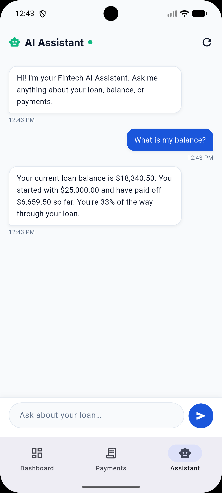

# Fintech AI Assistant

> A Flutter mobile app that simulates a customer-facing fintech experience — loan dashboard, payment history with filters, and an AI assistant that answers questions about the user's account.

[](https://flutter.dev)
[](https://dart.dev)
[](https://riverpod.dev)
[](https://pub.dev/packages/go_router)
[](LICENSE)

---

## Overview

This is a portfolio project built to practice the kind of work a junior engineer at a fintech company might do day to day: building customer-facing mobile screens, consuming APIs, managing app state, wiring authentication, and integrating AI assistant flows.

The app uses **mock data only** — there is no backend. The architecture is deliberately structured so the mock service layer can be swapped for a real Django REST API and the keyword-matching assistant can be swapped for a real LLM agent with minimal changes to the rest of the app.

> **Disclaimer:** This is a learning project. All user data, loan details, and AI responses are mocked locally. No real customer data, financial transactions, or external API calls are involved. Do not use this code for any real lending or financial product without proper review.

---

## Screenshots

> _Drop the captured PNGs into [`docs/screenshots/`](docs/screenshots/) using the exact filenames below. See [`docs/screenshots/README.md`](docs/screenshots/README.md) for capture commands._

| Login | Dashboard |
|---|---|
|  |  |

| Payments | AI Assistant |
|---|---|
|  |  |

---

## Tech Stack

| Layer | Choice |
|---|---|
| Framework | **Flutter** (Material 3) |
| Language | **Dart 3** |
| State management | **flutter_riverpod** — `FutureProvider`, `StateNotifierProvider`, derived `Provider`s |
| Navigation | **go_router** — declarative routes, `ShellRoute` for the bottom nav, `redirect` for the auth guard |
| Formatting | **intl** — currency + date formatting |
| HTTP (future) | **http** — wired through an `ApiClient` abstraction |

---

## Features

- **Mock authentication** with a global `AuthProvider`, route-level guard via GoRouter `redirect`, and a logout flow from the profile menu
- **Dashboard** with a gradient loan-balance hero card, progress bar, next-payment card, AI assistant promo, and recent payments — supports pull-to-refresh
- **Payments screen** with filter chips (All / Paid / Upcoming / Late) and a tap-to-detail bottom sheet
- **AI assistant** chat UI with suggestion chips, animated typing indicator, auto-scroll, and 10+ supported question types
- **Polished theme** with a centralized color, spacing, and text-style system
- **Reusable widget library** for cards, status badges, list items, chat bubbles, loading, and error states
- **Tests** — 20 passing tests across services, providers, and a smoke test

---

## Architecture

The app is split into four layers. Data flows top-down; nothing in a lower layer imports from a higher one.

```
┌─────────────────────────────────────────────────────────┐
│  Screens + Widgets                       UI layer       │
└─────────────────────────────────────────────────────────┘
                          ↑
┌─────────────────────────────────────────────────────────┐
│  Providers (Riverpod)                    State layer    │
└─────────────────────────────────────────────────────────┘
                          ↑
┌─────────────────────────────────────────────────────────┐
│  Services (Mock / future Remote)         Service layer  │
└─────────────────────────────────────────────────────────┘
                          ↑
┌─────────────────────────────────────────────────────────┐
│  Models (fromJson / toJson)              Data layer     │
└─────────────────────────────────────────────────────────┘
```

A full walk-through of the data flow, auth redirect, and swap-in paths lives in [`docs/ARCHITECTURE.md`](docs/ARCHITECTURE.md).

### State management

Riverpod is used as the single source of truth for app state:

| Provider type | Used for |
|---|---|
| `FutureProvider<T>` | Async data fetches with built-in loading/error/data states — `loanProvider`, `paymentsProvider` |
| `StateProvider<T>` | Lightweight UI state — `paymentFilterProvider` |
| `StateNotifierProvider<N, S>` | Mutable state with logic — `authProvider`, `chatProvider` |
| `Provider<T>` | Derived/computed values — `filteredPaymentsProvider`, `appRouterProvider` |

Widgets subscribe with `ref.watch(provider)` inside `build()` and call mutating methods with `ref.read(provider.notifier)` from callbacks.

### Routing & auth

GoRouter is configured with a `ShellRoute` that hosts the bottom-nav tabs (`/dashboard`, `/payments`, `/assistant`) and a top-level `/login` route. A `redirect` callback reads `authProvider` and:

- sends **unauthenticated users** to `/login`
- sends **authenticated users away from** `/login`

The login screen never calls `context.go()` — it just updates `authProvider`, and the router handles the consequence. This is the "reactive routing" pattern bridged into Riverpod via a `ValueNotifier` adapter.

### AI assistant

`AiAssistantService` lives in `lib/services/mock_api_service.dart`. Today it's a keyword-matching engine ordered specifically-to-generally:

- **Specific patterns first** — `"paid so far"` is checked before `"balance"` so `"How much have I paid so far?"` doesn't match the balance branch.
- **Helpers** — `_explainStatus(loan)` and `_nextStepAdvice(loan, late)` build contextual replies.
- **Swap-in ready** — the public surface is `Future<ChatMessage> sendChatMessage(String)`. Replacing the body with an OpenAI/Anthropic call is a one-method change; no UI changes needed.

Supported questions include: balance, next payment, late payments, paid so far, progress percentage, loan summary, upcoming payments, interest rate, loan status explanation, and "what should I do next?" advice.

---

## Folder Structure

```
lib/
├── main.dart                   # ProviderScope + MaterialApp.router
├── models/                     # Plain Dart models, fromJson/toJson
│   ├── chat_message.dart
│   ├── loan.dart
│   ├── payment.dart
│   └── user.dart
├── providers/                  # Riverpod state
│   ├── auth_provider.dart
│   ├── chat_provider.dart
│   ├── loan_provider.dart
│   └── payments_provider.dart
├── router/
│   └── app_router.dart         # GoRouter + auth redirect + ShellRoute
├── screens/                    # One file per route
│   ├── assistant_screen.dart
│   ├── dashboard_screen.dart
│   ├── login_screen.dart
│   ├── payments_screen.dart
│   └── shell_screen.dart
├── services/
│   ├── api_client.dart         # HTTP abstraction (stub for future backend)
│   └── mock_api_service.dart   # MockApiService + AiAssistantService
├── utils/
│   └── app_theme.dart          # AppColors, AppTheme, AppSpacing
└── widgets/                    # Reusable, prop-driven (no Riverpod inside)
    ├── app_error_widget.dart
    ├── app_loading_widget.dart
    ├── chat_bubble.dart
    ├── fintech_card.dart
    ├── payment_list_item.dart
    └── status_badge.dart

docs/
├── ARCHITECTURE.md             # Layered overview, data flow, swap-in guides
└── LEARNING_NOTES.md           # Study guide for the codebase

test/
├── providers/auth_provider_test.dart
├── services/ai_assistant_service_test.dart
├── services/mock_api_service_test.dart
└── widget_test.dart
```

---

## Getting Started

### Prerequisites

- [Flutter SDK](https://docs.flutter.dev/get-started/install) (Dart 3+)
- Android Studio / Xcode / VS Code with the Flutter extension
- An Android emulator, iOS simulator, or physical device

### Run

```bash
git clone <your-fork-url>
cd fintech-ai-assistant
flutter pub get
flutter run
```

### Demo credentials

The login screen accepts **any valid email** and **any password 6+ characters long**. The mock service always returns the same fixed user, regardless of the email entered.

### Tests

```bash
flutter test       # runs all 20 tests
flutter analyze    # static analysis — must report no issues
```

---

## Learning Goals

This project exists to deliberately practice:

- **Idiomatic Riverpod** — picking the right provider type, splitting state, deriving computed providers, knowing when to `watch` vs `read`
- **Reactive routing** — wiring GoRouter to auth state without imperative navigation
- **Layered architecture** — keeping screens thin, services replaceable, models pure
- **Mock-first development** — building an entire app end-to-end before any backend exists
- **Testing fundamentals** — `ProviderContainer` for provider tests, behavior-focused service tests
- **Material 3 theming** — one source of truth for colors, spacing, and text styles

A self-paced study guide for the codebase lives in [`docs/LEARNING_NOTES.md`](docs/LEARNING_NOTES.md).

---

## Future Improvements

### Backend integration
- Implement `HttpApiClient.get()` / `.post()` with timeouts, retries, and centralized 401 handling
- Build a `RemoteApiService` that mirrors the `MockApiService` surface
- Introduce an `apiServiceProvider` toggled by a `--dart-define=USE_MOCK_API=false` build flag

### Real AI / LLM agent
- Replace `AiAssistantService._respond` body with an HTTP call to a real model provider
- Add a `PromptBuilder` that injects the user's loan + payments as JSON context
- Support tool calls so the agent can fetch fresh data on demand
- Stream responses token-by-token (the provider already exposes `isLoading`)

### Auth hardening
- Persist tokens via `flutter_secure_storage`
- Add a `restoreSession()` hook in `main()` so returning users skip the login screen
- Add biometric login via `local_auth`

### Other natural next steps
- Widget tests for the dashboard's `AsyncValue` branches
- Deep links via GoRouter URL paths
- Sentry / Crashlytics integration
- Real app icon and splash screen
- Dark mode preview screenshots

---

## Documentation

- [`docs/ARCHITECTURE.md`](docs/ARCHITECTURE.md) — layered overview, data flow, mock → real swap-in guide
- [`docs/LEARNING_NOTES.md`](docs/LEARNING_NOTES.md) — Riverpod / GoRouter / `AsyncValue` study notes
- [`CONTRIBUTING.md`](CONTRIBUTING.md) — conventions, setup, good first contributions

---

## License

[MIT](LICENSE) — feel free to use this as a reference or starting point for your own work.
